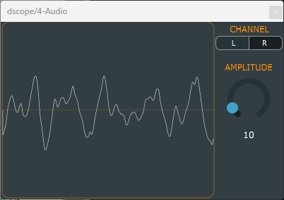

# dscope
### Video Demo: <https://youtu.be/PL9NBLH8HPM>
### Description:
**dscope** is an audio plugin for use as a functional extension to audio applications that are able to host such plugins. **dscope** lets you see the audio signal sent into the plugin in the time-domain, as an oscilloscope would show an electronic signal. **dscope** has two simple controls: the `CHANNEL` button for selecting either the Left or Right of a stero input, and the `AMPLITUDE` knob to adjust signal height.

**dscope** uses the [JUCE](https://juce.com/) audio application and plugin framework and was developed on a *Windows 11* system using *Microsoft Visual Studio 2022* in *C++*. Though *JUCE* makes it easy to deliver software for many platforms, I focused **dscope** development on the 64-bit *VST3* (Virtual Studio Technology) format for use in a typical *DAW* (Digital Audio Workstation). All testing was done in *Ableton Live Lite 11*.

### Theory of Operation:
**dscope** is written in JUCE's two basic C++ modules, `PluginEditor` and `PluginProcessor`. `PluginEditor` implements the UI (user interface) of the plugin, drawing the interface window, all controls, and the **dscope** waveform screen itself. Creating the UI starts with the constructor of the `DscopeAudioProcessorEditor` class which instantiates and configures all UI objects. This class also uses a `juce::Timer` object to refresh the UI periodically, 30 times per second, to render the waveform view along with the controls.

The input signal is processed in the `PluginProcessor` module, in the `processBlock` method of the `DscopeAudioProcessor` class. `processBlock` is called in a high-priority thread with real-time audio data from the plugin's input, as passed to it from the plugin host (or DAW in the common case). This method simply records the block of data passed-in into a public buffer that is accessible by the `DscopeAudioProcessorEditor` class to use in displaying the waveform of the audio signal.

The UI has a `CHANNEL` radio button for selecting which column of the stereo, 2-channel, audio buffer to use in displaying the audio signal waveform. The UI also has an `AMPLITUDE` knob for selecting a multiplying factor to the signal's volume, adjusting the viewable height of the waveform.

Though **dscope** is not functionally complex, audio processing code like this uses a good bit of intricate data handling, threading considerations, and time management. The point of writing **dscope** was to get started in performing some useful audio signal processing to allow continued development into bigger and better tools, particularly to be used in DAWs. Though JUCE makes this kind of development very easy, it was still challenging figuring our how to use it specifically for this function. One very time-consuming challenge was trying to use JUCE's `AudioVisualisationComponent`, a JUCE library object that appears to be useful a waveform control out of the box. From JUCE documentation and online reports, it looked as though this would be an easy way to create the basis of **dscope**, letting me spend most of my time on features. However, it doesn't appear to work in the plugin scenario. Maybe I'll find a way through this to save time later on the way to **dscope v2**.

### Future Features:
A *triggering* method will be my next feature addition. This will let me find a way to stabilize the waveform within the display area. I have not solved the issue yet of the woveform *rolling* as it's being displayed. This is happening because the refresh of the screen is not synchronized with the waveform it is displaying. If I did synchronize the refresh with the waveform, it would be displayed with more stability. The very next feature addition will be *auto amplitude* which will display the waveform using most of the height of the display area regardless of the actual signal amplitude, as if the amplitude knob moved itself to optimally use the display height. A *frequency-domain/spectral* display mode would be a great addition. Also, *automatic measurement* features to show aspects of the waveform such as *frequency*, and actual *volume in dB*, would be useful.
